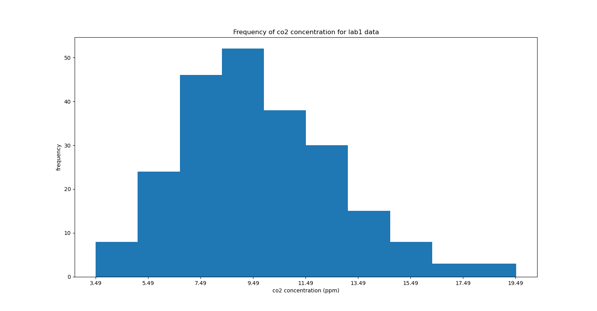
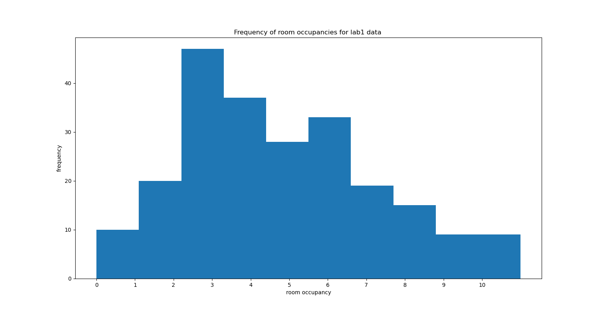
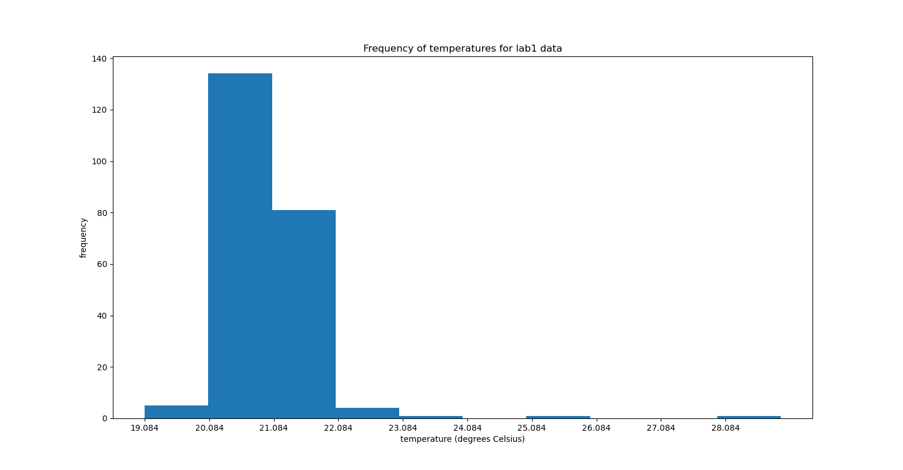
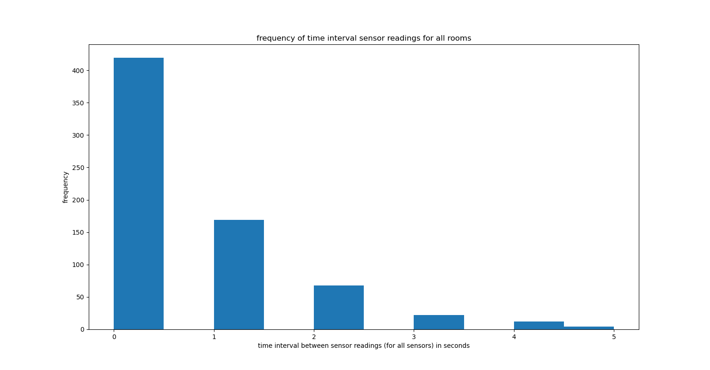

Boston University 2020 Sensor Mini-Project Memo

To: Professor Hirsch, Sensor Project Supervisor

From: Andrew Chen, Henry Bojanowski

Subject: Evaluation of Temperature, Occupancy, and CO2 Room Sensors

September 17, 2020

**Introduction and Summary**

As requested on September 8, 2020, we ran a simulation of various sensors for temperature, occupancy, and CO2 in three different rooms, Lab 1, Class 1, and Office 1. Upon running the client for the sensors, the first greeting string issued by the server was &quot;ECE Senior Capstone IoT Simulator&quot;. After collecting the JSON data to a text file, the Lab 1 room was chosen for sensor data analysis. After parsing through temperature values from the room, the median temperature value was calculated to be around 21 C°, and the temperature variance was calculated to be roughly 0.539. Calculations on the occupancy data values in the same room resulted in a median occupancy of 4 people and a occupancy variance of roughly 5.51. The data histogram/frequency chart for each sensor type for Lab 1 can be seen attached below in Figures 1 through 3. Additionally, after analyzing all the time intervals between sensor readings across all rooms, the mean time interval was calculated to be roughly 0.633 secs with a variance of 0.941. The histogram for these time intervals can be seen in Figure 4. The time interval distribution mimics an Erlang distribution with a shape parameter of k=1, resembling exponential decay.

**Figure 1**

**Figure 2**

**Figure 3**

**Figure 4**

After computing relatively large variances for sensor data, especially for temperature readings, an algorithm was created to detect data anomalies. The algorithm was set up to cutoff temperature readings above ~21.73 C° and below ~20.36 C° from the Lab 1 room. The percent of &quot;bad&quot; data points for all readings in Lab 1 was ~7.92 %. With these erroneous temperature readings from Lab 1 discarded, the new median was 21 C° and the new variance was ~0.0373. The possible cut off temperatures set for Class 1 were determined to be any readings above ~33.50 C° or below ~18.73 C°. And likewise for the Office all temperature readings higher than ~24.72 C° or lower than ~21.50 C° were excluded. It should be important to note that a persistent change in temperature doesn&#39;t necessarily indicate a failed sensor. Possible explanations could be malfunctions in the room&#39;s thermostat or HVAC system. The temperature regulation could be broken, resulting in the air conditioning continually decreasing the temperature, or the heater continually increasing the temperature. A less realistic, although plausible explanation could be a large scale building fire, which could cause consistent increases in temperature readings.

**Conclusion**

This simulation is reflective of the real world in that there are faulty sensor readings dispersed among actual sensor readings. This models how sensor noise and other unavoidable issues may result in issues that cause bad sensor readings. Additionally, the need to implement an error checking system on sensor readings is quite realistic as they are also used in actual sensor applications. Another real aspect of the simulation was the useful data collected, temperature, CO2 levels, and occupancy are all necessary to meet OSHA building guidelines for temperature, CO2 ppm levels, and occupancy. On the other hand, the simulation&#39;s sensor reading intervals are quite unrealistic. For normal sized rooms, temperatures, CO2 levels, and occupancy, don&#39;t fluctuate so much over the span of a few seconds. It is understandable that these simulated short intervals were meant to allow for many sensor readings for data analysis, but in the real world the time interval would be significantly larger especially from an economic standpoint as consistent storage of relatively unimportant data every few seconds wouldn't make much sense. Lastly another unrealistic aspect would be the high digits of significance being outputted by the temperature sensors, such high precision isn't realistic in today's sensors. In this case with three different sensors types in three different rooms, it would be better for the server to poll the sensors rather than have the sensors reach out to the server, as the number of sensors are relatively small. Furthermore, this would also allow the server to regularly troubleshoot sensor issues or detect and filter out erroneous data.

This sensor simulation completely utilized Python&#39;s web socket library. From the experience working with the Python simulation, it is clear that the servers and clients in said library focus on simplicity, which can allow for quick prototyping and easy collaboration between team members. Compiled language websockets are considerably more difficult to use, as the program needs to be constantly compiled prior to testing which is significantly harder to work on compared to Python&#39;s dynamic typing. Additionally, compiled languages are platform dependent, heavily tied to OS kernels, which may pose issues with program sharing in collaborative work such as this project.
